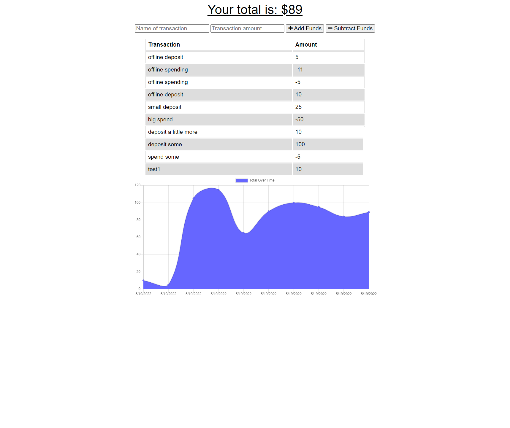

  # Harabushi's Budget Tracker

  ## Description
  
   
  This app allows you to track your budget and spending, even while offline!
   
  [Repo: GitHub](https://github.com/Harabushi/harabushis-budgetizer)
   

  

  ## Table of Contents

  - [Installation](#installation)
  - [Usage](#usage)
  - [Credits](#credits)
  - [License](#license)

  ## Installation

  just visit the website!
   
   

  ## Usage

  Super simple, you can only do two things. you can deposit or subtract
   
   

  ## License

  
  Licensed under the [MIT](https://opensource.org/licenses/MIT) license.
  
   
   

  ## Contributing

  no current contribution guidelines
   
   

  ## Tests

  no current test info
   
   

  ## Questions

  If you have any questions about this project please reach out either through GitHub or my email. 
  Please include the name of the project in the subject line and any other relevant information in the content. 

  [github.com/Harabushi](https://github.com/Harabushi) 
  [harabushi.creations@gmail.com](mailto:harabushi.creations@gmail.com)
   
   
  
  ### Credits

  The class and instructors!
